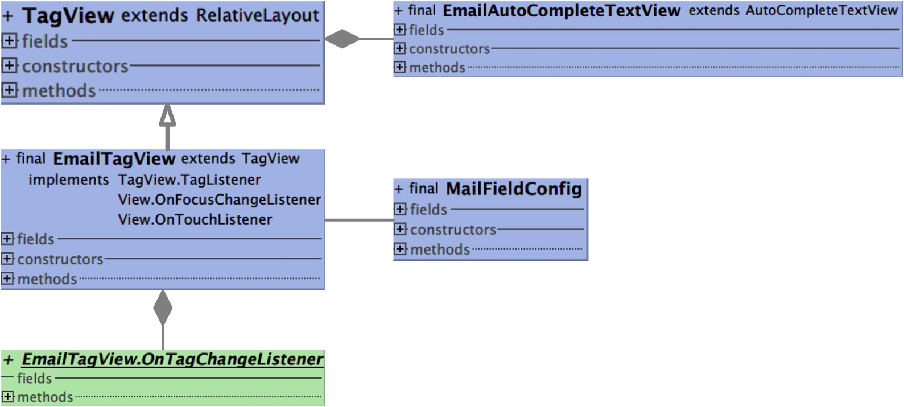

## MailField 邮件输入框控件

#### 1.简介

邮件发送页面输入框控件，用于邮件地址输入，邮件地址错误检查，获取输入地址等
[GitLab地址](https://gitlab.gz.cvte.cn/i_tuwentai/libmailfield) :https://gitlab.gz.cvte.cn/i_tuwentai/libmailfield
<center class="half">    
  
</center>


#### 2.使用方式

##### 控件主类名 EmailTagView，使用方法如下：

`<include layout="@layout/layout_mail_address_field"/>`

| EmailTagView | 外部使用方法                                          | 方法说明                                                |
| ------------ | ----------------------------------------------------- | ------------------------------------------------------- |
| 1            | setOnTagChangeListener(listener: OnTagChangeListener) | 监听当前所有Tag数量，地址是否合理                       |
| 2            | setRecipientLimit(limit: String)                      | 设置邮箱后缀添加限制                                    |
| 3            | getAllAddress(): String                               | 获取所有邮件地址                                        |
| 4            | getTagCount(): Int                                    | 获取地址Tag个数                                         |
| 5            | hasInvalidTag(): Boolean                              | 获取是否有不正确的Tag                                   |
| 6            | getAutoTv() : EmailAutoCompleteTextView               | 返回字符输入控件引用                                    |
| 7            | changeFocusAutoAddTag()                               | 设置邮件输入框失去焦点，若存在输入则自动生成邮件地址Tag |
| 8            | clear()                                               | 清空输入框所有内容                                      |
| 9            | destroy()                                             | 释放资源                                                |

##### 输入框可配置项：
可通过MailFieldConfig配置控件属性

```kotlin
object MailFieldConfig {

    //use dp and sp, not px
    /*----------------- separator TagView -----------------*/
    var DEFAULT_LINE_MARGIN = 2.67f
    var DEFAULT_TAG_MARGIN = 2.67f
    var DEFAULT_TAG_TEXT_PADDING_LEFT = 4f
    var DEFAULT_TAG_TEXT_PADDING_TOP = 4f
    var DEFAULT_TAG_TEXT_PADDING_RIGHT = 4f
    var DEFAULT_TAG_TEXT_PADDING_BOTTOM = 4f
    var TAG_ON_FOCUS_SCROLLVIEW_BG_RES_ID = R.drawable.email_scrollview_focus_back
    var TAG_ON_OUT_FOCUS_SCROLLVIEW_BG_RES_ID = R.drawable.email_scrollview_not_focus_back
    // 地址过长默认自动换行距离，若有地址后缀则此长度为后缀长度
    var TAG_LINE_FEED_DISTANCE = 20f


    /*----------------- separator Tag Item -----------------*/
    // 默认地址Tag属性配置
    var DEFAULT_TAG_TEXT_SIZE = 10f
    var DEFAULT_TAG_DELETE_INDICATOR_SIZE = 12f
    var DEFAULT_TAG_LAYOUT_BORDER_SIZE = 0f
    var DEFAULT_TAG_RADIUS = 3f
    var DEFAULT_TAG_LAYOUT_BORDER_COLOR = Color.parseColor("#ffffff")
    // 邮件Tag删除按钮是否显示
    var DEFAULT_TAG_IS_DELETABLE = true
    var DEFAULT_TAG_LAYOUT_COLOR = Color.parseColor("#EEEEEE")
    var DEFAULT_TAG_LAYOUT_COLOR_PRESS = DEFAULT_TAG_LAYOUT_COLOR
    var DEFAULT_TAG_TEXT_COLOR = Color.BLACK
    var DEFAULT_TAG_DELETE_BG_RES_ID = R.drawable.email_delete_right_selector
    var DEFAULT_TAG_DELETE_INDICATOR_COLOR = Color.parseColor("#000000")
    // 错误地址Tag属性配置
    var TAG_WRONG_ADDRESS_LAYOUT_COLOR = Color.parseColor("#FF5555")
    var TAG_WRONG_ADDRESS_LAYOUT_COLOR_PRESS = TAG_WRONG_ADDRESS_LAYOUT_COLOR
    var TAG_WRONG_ADDRESS_TEXT_COLOR = Color.WHITE
    var TAG_WRONG_DELETE_BG_RES_ID = R.drawable.email_delete_error_selector
    var TAG_WRONG_DELETE_INDICATOR_COLOR = Color.parseColor("#000000")


    /* ------------------ separator for other---------------*/
    // 字符输入AutoCompleteTextView属性配置
    var AutoCompleteTextView_DROPDOWN_BG_RES_ID = R.drawable.bg_small_shadow
    var AutoCompleteTextView_ITEM_TEXT_COLOR = Color.parseColor("#898989")
    var AutoCompleteTextView_TEXT_SIZE = DEFAULT_TAG_TEXT_SIZE
    var AutoCompleteTextView_TEXT_COLOR = Color.parseColor("#262626")
    var AutoCompleteTextView_HEIGHT = 21.33f
    // 是否需要显示邮件下拉列表，是：则显示MAIL_SUFFIXS中的后缀
    val NEED_SHOW_AUTO_COMPLETE = false
    var MAIL_SUFFIXS = arrayOf("@cvte.com", "@qq.com", "@163.com", "@gmail.com")
    // MaxHeightScrollView默认最高高度
    var SCROLLVIEW_MAX_HEIGHT = 104f
    var TAG_ADDRESS_SUFFIX_LIMITATION_TEXT_COLOR = Color.parseColor("#BBBBBB")

}
```

#### 3.实现原理

##### 布局：


###### （1）最外层采用ScrollView为了使达到最大高度时变为滑动；

###### （2）第二层加入LinearLayout作为ScrollView子布局，同时便于边缘距离比内部多一倍；

###### （3）第三层采用RelativeLayout为了使用其子View便于对齐的特性，如ALIGN_TOP、ALIGN_BOTTOM

##### 邮件Tag对齐

###### （1）边界padding 0.5dp避免内部Tag或者滑动条遮挡背景框

###### （2）Linearlayout padding 2.17dp 外边框距离内部Tag多添加一倍宽度

###### （3）For循环中根据所有地址列表，一次性添加所有地址View

​         每个Tag设置setId(id)，用于后一个Tag与前一个对齐，同时记录每行第一个Tag ID，用以右、下Tag对齐；

​         第一个Tag单独处理，设置top、left、right Margin；

​         第二个Tag开始，判断是否需要添加到新行，一行中每添加一个Tag则total = total + tagWidth + tagMargin，若mWidth < total + tagWidth + tagMargin * 2，即当前待插入Tag宽度大于本行剩余宽度 (tagWidth > mWidth - total - tagMargin * 2)则添加到新行，并设置top、left、right Margin，否则往右添加并设置right Margin；

​         到达最后一个Tag，添加bottomMargin；

​         注：total为本行已添加Tag宽度加上Tag之间margin、mWidth为EmailTagView宽度;

###### （4）所有Tag绘制完在尾部添加AutoCompleteTextView

​         无邮件地址Tag，仅设置left、right Margin；

​         有Tag，mWidth - total - tagMargin * 2 <= tagLineFeedDistance判断本行剩余宽度是否小于AutoCompleteTextView 添加至新行的最小值，是则添加到新行且设置left、right Margin，否则往右添加并设置right Margin；

​         有文字（重新编辑邮件），(mWidth - total - tagMargin * 2) <= (tagLineFeedDistance + textLength)则添加到新行且设置left、right Margin，否则往右添加设置right Margin；

​         动态换行时监听输入长度，处于整行则不换行（即第一次输入或已被添加到整行），换行时添加left Margin.

##### 类图

