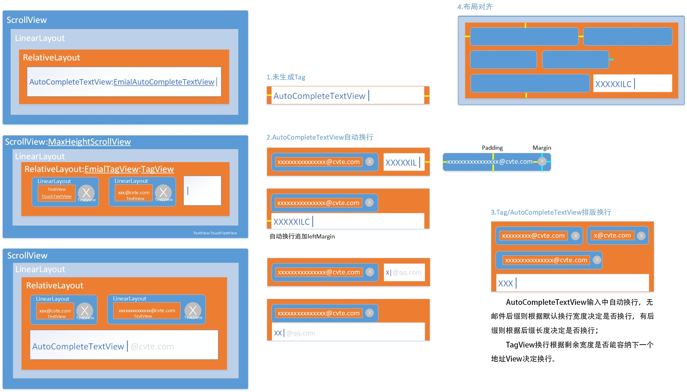

## MailField 邮件输入框控件

#### 1.简介

邮件发送页面输入框控件，用于邮件地址输入，邮件地址错误检查，获取输入地址等

    
  

#### 2.使用方式

##### 控件主类名 EmailTagView，使用方法如下：

`<include layout="@layout/layout_mail_address_field"/>`

| EmailTagView | 外部使用方法                                          | 方法说明                                                |
| ------------ | ----------------------------------------------------- | ------------------------------------------------------- |
| 1            | setOnTagChangeListener(listener: OnTagChangeListener) | 监听当前所有Tag数量，地址是否合理                       |
| 2            | setRecipientLimit(limit: String)                      | 设置邮箱后缀添加限制                                    |
| 3            | getAllAddress(): String                               | 获取所有邮件地址                                        |
| 4            | getTagCount(): Int                                    | 获取地址Tag个数                                         |
| 5            | hasInvalidTag(): Boolean                              | 获取是否有不正确的Tag                                   |
| 6            | getAutoTv() : EmailAutoCompleteTextView               | 返回字符输入控件引用                                    |
| 7            | changeFocusAutoAddTag()                               | 设置邮件输入框失去焦点，若存在输入则自动生成邮件地址Tag |
| 8            | clear()                                               | 清空输入框所有内容                                      |
| 9            | destroy()                                             | 释放资源                                                |

##### 输入框属性配置：
无配置则采用默认实现(如上图)，若需配置属性，则重写`<include layout="@layout/layout_mail_address_field"/>`布局，EmailTagView可配置如下属性：

| 属性名称                    | 意义 | 属性名称 |   意义   |
| --------------------------- | ---- | -------- | ---- |
| lineMargin                  | 行间距 | tagTextSize | Tag文字大小 |
| tagMargin                   | Tag之间间距 | tagTextColor | Tag文字颜色 |
| focusScrollViewBg           | 有焦点背景 | tagAbnormalTextColor | 异常Tag文字颜色 |
| loseFocusScrollViewBg       | 无焦点背景 | tagTextPaddingLeft | Tag文字左间距 |
| editTvDropdownBg | 输入下拉框背景 | tagTextPaddingRight | Tag文字右间距 |
| editTvDropdownItemTextColor | 下拉框文字颜色 | tagTextPaddingTop | Tag文字上间距 |
| editTvTextSize              | 输入文字大小 | tagTexPaddingBottom | Tag文字下间距 |
| editTvTextColor             | 输入文字颜色 | tagNormalLayoutBg | Tag背景 |
| editTvSuffixColor           | 后缀限制hint颜色 | tagAbnormalLayoutBg | 异常Tag背景 |
| editTvHeight                | 输入EditText高度 | tagAbnormalDeleteBg | Tag删除按钮背景 |
| editTvShowDropdownList      | 是否显示下拉列表 | tagAbnormalDeleteBg | Tag异常下删除按钮背景 |
| editTvLineFeedDistance      | 默认EditText换行剩余距离 | tagIsDeletable | 是否显示Tag删除按钮 |

​    var tagIsDeletable = true
​    var editTvDropdownBg = 0
​    var editTvDropdownItemTextColor = 0
​    var editTvTextSize = 0f
​    var editTvTextColor = 0
​    var editTvSuffixColor = 0
​    var editTvHeight = 0
​    var editTvShowDropdownList = false

#### 3.实现原理

##### 布局：

###### （1）最外层采用ScrollView为了使达到最大高度时变为滑动；

###### （2）第二层加入LinearLayout作为ScrollView子布局，同时便于边缘距离比内部多一倍；

###### （3）第三层采用RelativeLayout为了使用其子View便于对齐的特性，如ALIGN_TOP、ALIGN_BOTTOM

##### 邮件Tag对齐

###### （1）边界padding 0.5dp避免内部Tag或者滑动条遮挡背景框

###### （2）Linearlayout padding 2.17dp 外边框距离内部Tag多添加一倍宽度

###### （3）For循环中根据所有地址列表，一次性添加所有地址View

​         每个Tag设置setId(id)，用于后一个Tag与前一个对齐，同时记录每行第一个Tag ID，用以右、下Tag对齐；

​         第一个Tag单独处理，设置top、left、right Margin；

​         第二个Tag开始，判断是否需要添加到新行，一行中每添加一个Tag则total = total + tagWidth + tagMargin，若mWidth < total + tagWidth + tagMargin * 2，即当前待插入Tag宽度大于本行剩余宽度 (tagWidth > mWidth - total - tagMargin * 2)则添加到新行，并设置top、left、right Margin，否则往右添加并设置right Margin；

​         到达最后一个Tag，添加bottomMargin；

​         注：total为本行已添加Tag宽度加上Tag之间margin、mWidth为EmailTagView宽度;

###### （4）所有Tag绘制完在尾部添加AutoCompleteTextView

​         无邮件地址Tag，仅设置left、right Margin；

​         有Tag，mWidth - total - tagMargin * 2 <= tagLineFeedDistance判断本行剩余宽度是否小于AutoCompleteTextView 添加至新行的最小值，是则添加到新行且设置left、right Margin，否则往右添加并设置right Margin；

​         有文字（重新编辑邮件），(mWidth - total - tagMargin * 2) <= (tagLineFeedDistance + textLength)则添加到新行且设置left、right Margin，否则往右添加设置right Margin；

​         动态换行时监听输入长度，处于整行则不换行（即第一次输入或已被添加到整行），换行时添加left Margin.

##### 类图

